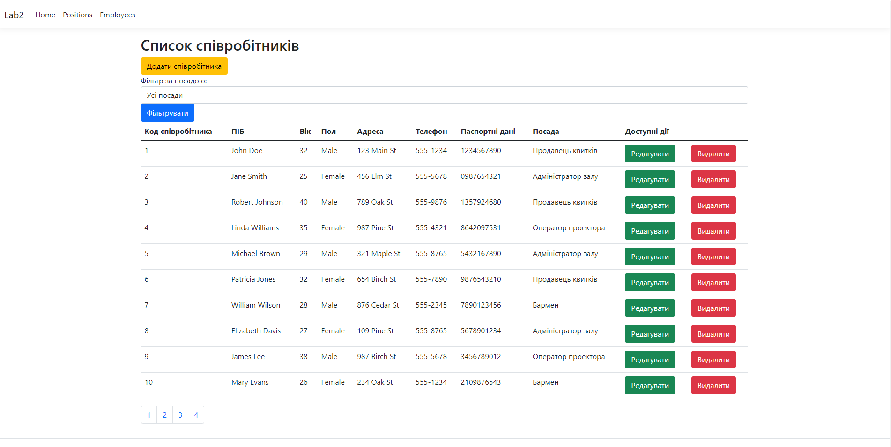
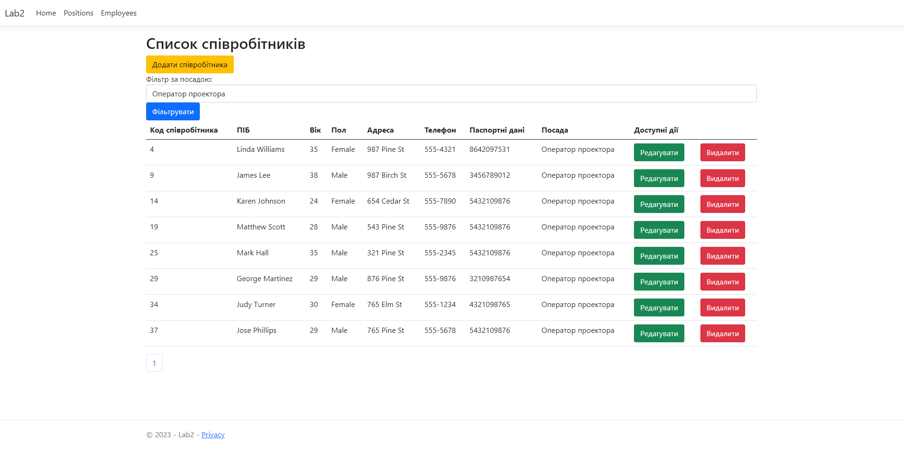
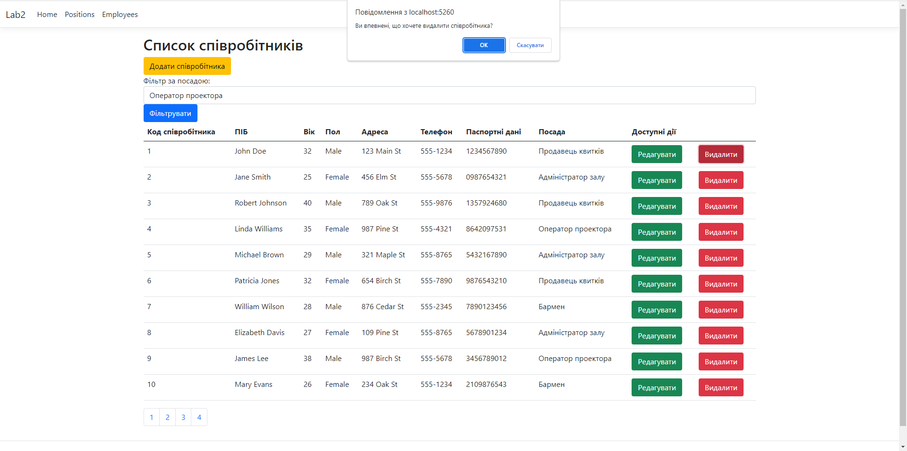

# Адмінка відділа кадрів кінотератру (академічне)

Варіант 4. Нікітін Владислав Віталійович РС-п11

## Про проект

Цей звіт описує процес розробки адміністративної панелі керування персоналом кінотеатру. Розробка була проведена з метою полегшити управління персоналом, графіками роботи, фінансами та іншими аспектами діяльності кінотеатру. Адмін-панель стала центральним інструментом для забезпечення ефективності і зручності роботи персоналу.

## Методологія розробки

Розробка адмін-панелі була розпочата із збору вимог завдання. Було проведено аналіз існуючих процесів та визначено основні функціональні вимоги. Далі розробка була розділена на кілька етапів:

Проектування: Було розроблено дизайн інтерфейсу, структуру бази даних та визначено основні функції панелі.

Розробка: Розробники приступили до програмування панелі з використанням сучасних технологій та інструментів розробки.

Тестування: Проведено тестування для перевірки функціональності, безпеки та стабільності панелі.

Впровадження: Після успішного тестування панель була впроваджена в роботу кінотеатру.

## Основні функції

- **Створення користувачів:** 

- **Видаляти користувачів:** 

- **Зміна даних користувачів** 

# Скріншоти

